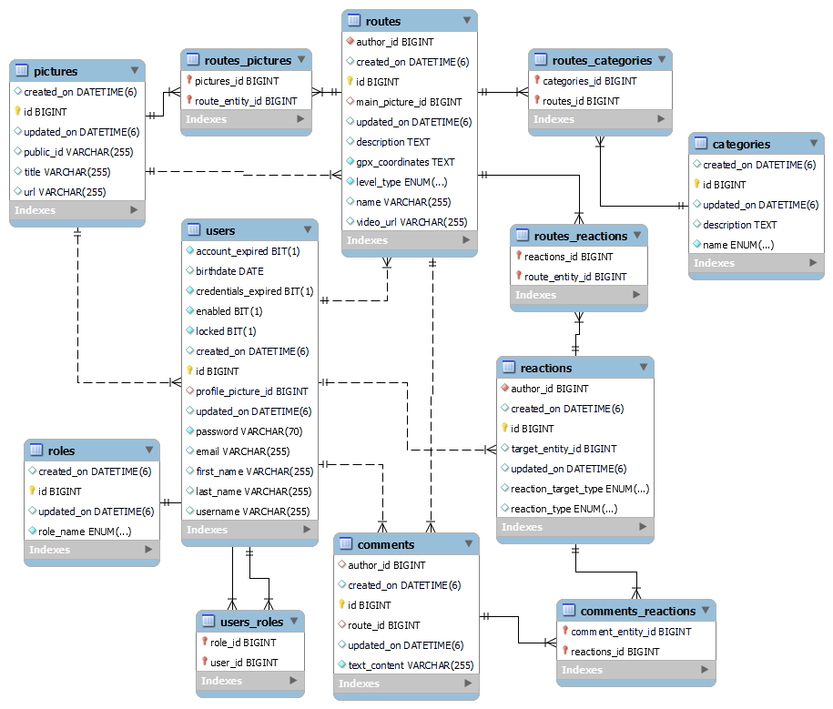
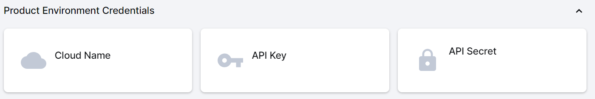
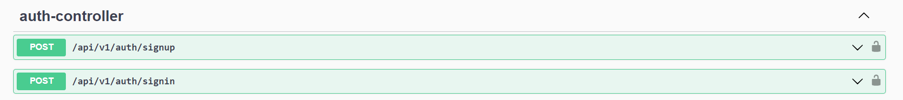
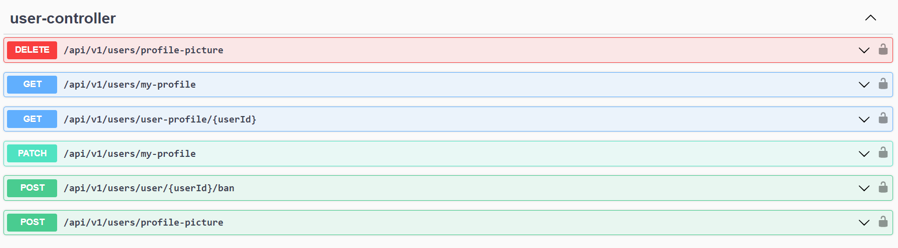
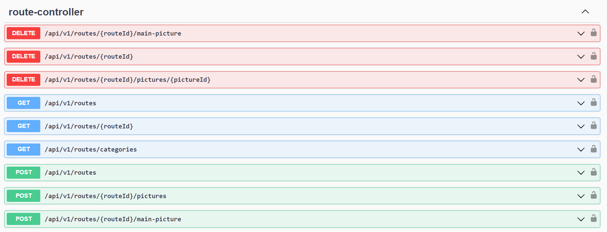
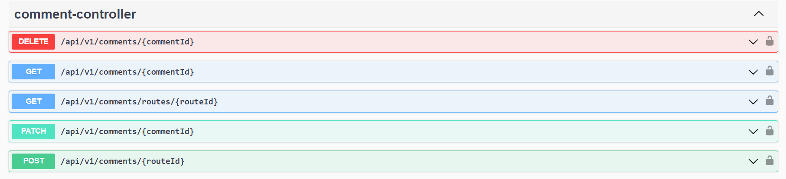
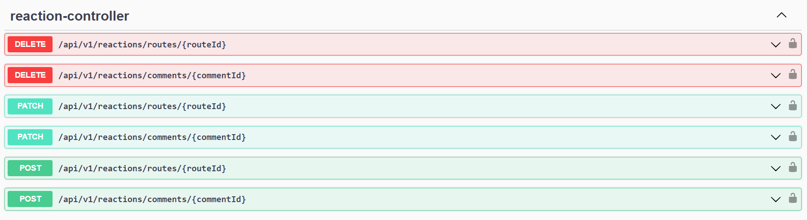

<h2>JourneyMate</h2>
<h2>Brief description</h2>
 <p>This project is application for finding routes and destinations and rate it.</p>
 <p>The backend service is with monolith architecture. It is a REST API and its using JWT tokens to authorize users.</p>
 
 <h2>Tech Stack:</h2>
<ul>
 <li>Java</li>
 <li>Spring Boot</li>
 <li>JUnit</li>
 <li>PostgresSQL</li>
 <li>Docker</li>
 <li>Cloudinary (for storing images)</li>
 <li>Swagger-UI (GUI for REST API documentation)</li>
</ul>

<h2>ER diagram:</h2>


## Local setup:
Example of Cloudinary:

```
1.1 Log in your cloudinary account or create it.(it is very simple)
1.2 You need cloudinary for storing images, so get yours credentials
1.3 credentials : CLOUD_NAME, API_KEY, API_SECRET
2.1 In the folder ./docker create .env file with values from .env.example.
2.2 Add your cloudinary credential to .env file and save file 
3.1 Run docker container in folder ./docker  `docker-compose up -d`
4.1 Test by Postman for example or something else
4.2 Use urls from API documentation
4.3 When you send login request, add Authorization in the request via Postman
    type: Bearer Token; Token: insert the JWT_SECRET_KEY from .env file
5.1 When you are logged, just copy the accessToken from the response of request.
5.2 Use the accessToken, as you used JWT_SECRET_KEY from .env file,
    for every new request, just add it to Authorization body of request.
6.1 And before every request, first see in the controllers what JSON body,
    they expect. 
7.1 Have fun!

```

<h2>API:</h2>





